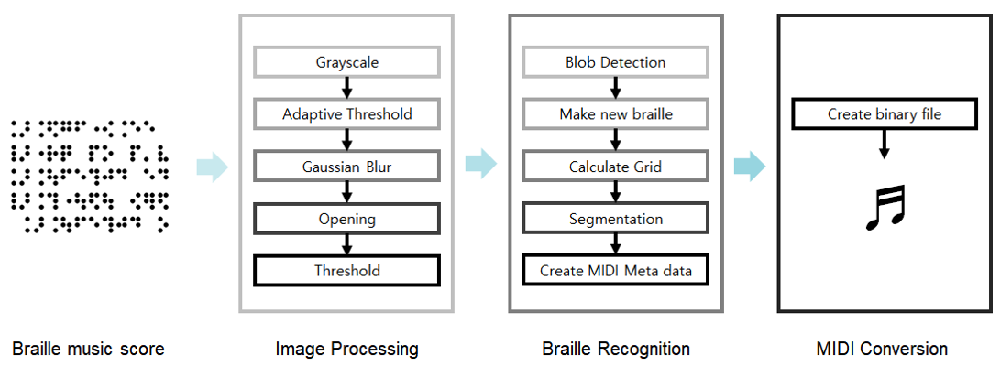
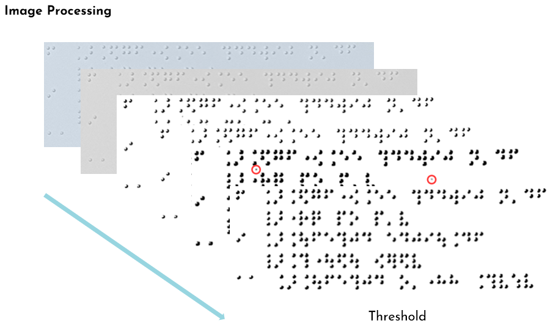
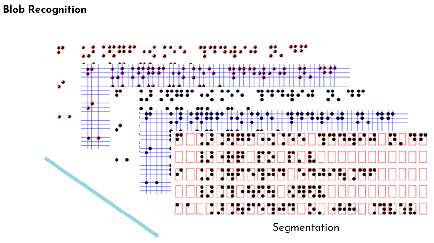
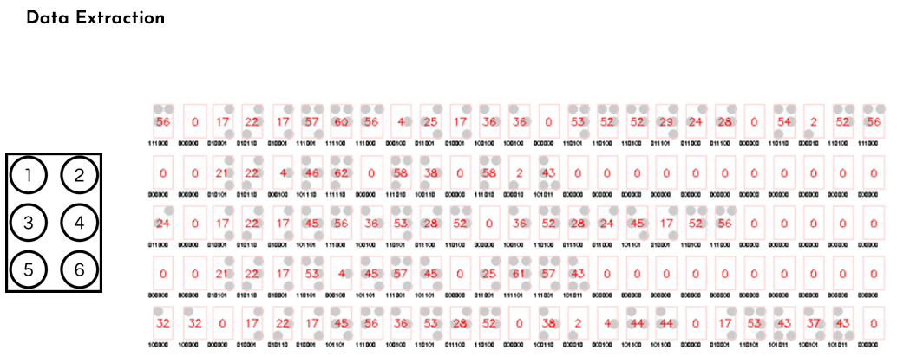
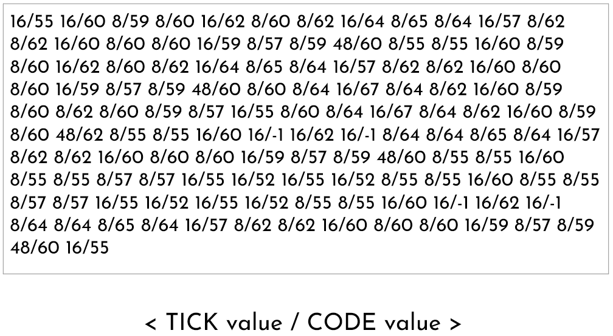
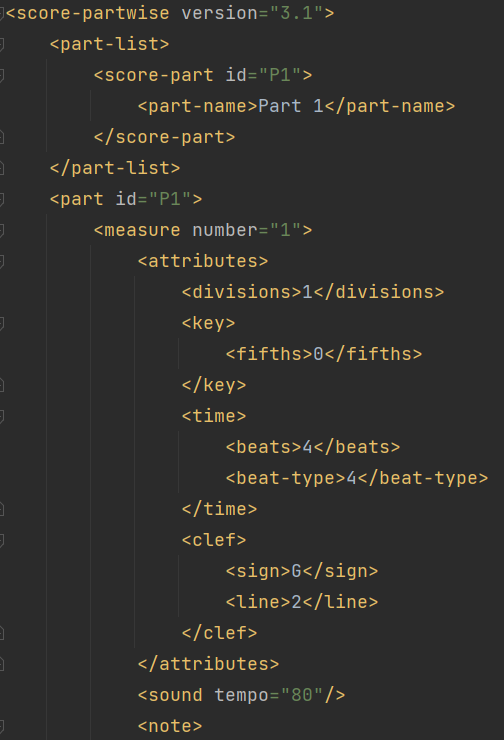
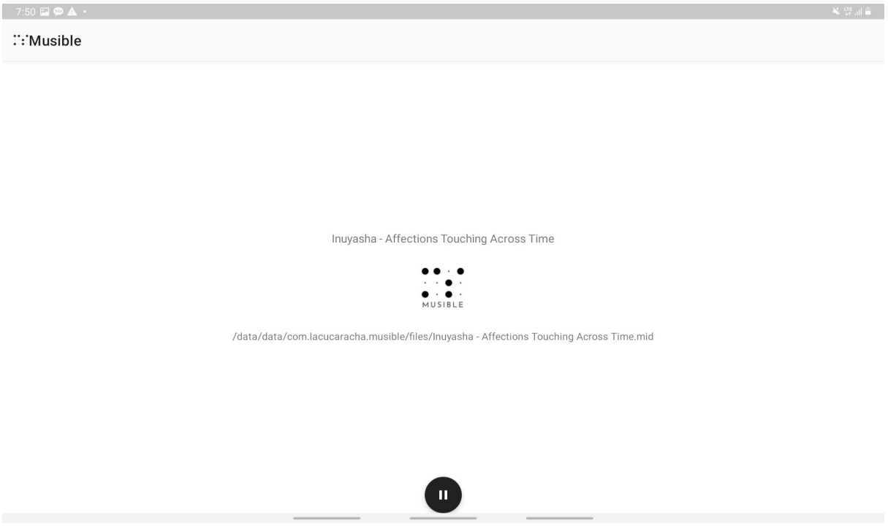
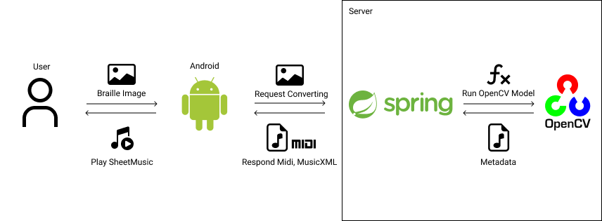
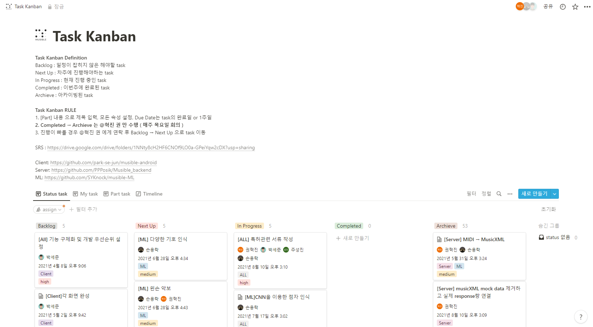
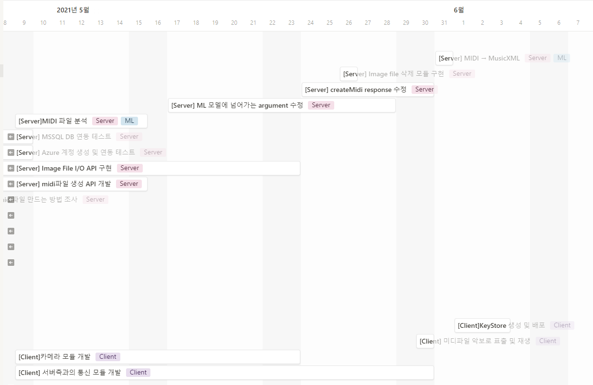

# Musible
Muisble backend Repository

#### 개요
- 전문가의 도움없이 점자 악보의 곡을 들을 수 없기 때문에 이를 해결하고자 진행된 프로젝트입니다.
- 컴퓨터 비전 기술을 이용하여 촬영한 점자 악보를 파일로 변환하고 재생하는 프로그램입니다.
- 사용자가 점자 악보를 업로드하면 해당 사진을 분석하여 midi file, musicXML 파일로 변환시킵니다. 변환된 파일은 본 프로그램을 통해 재생할 수 있고 다른 상용 프로그램에서도 사용할 수 있습니다.

---
#### 프로젝트 기능
- 점자 악보 인식 및 일반 악보 변환

위의 과정을 통해 점자 악보를 인식하고 재생 가능한 일반 악보 파일을 생성합니다.
점자 악보를 3단계에 거쳐 일반 악보 파일로 변환합니다.
1. 이미지를 올바르게 인식하기 위한 이미지 처리과정으로 Grayscale, Adaptive threshold, Gaussian blur, Opening, Threshold를 사용하여 노이즈를 제거하고 원하는 오브젝트 (점자)만이 남은 이진화된 이미지를 얻습니다.
2. 이전 단계에서 추출한 이미지에서 얼룩을 검출하고 좌표를 만들어 점자로 분류하고 인식하는 작업을 진행합니다.
3. 마지막으로 변환된 점자들을 표준 점자 규격에 맞추어 metadata를 생성합니다.
4. 서버는 결과 metadata로 재생 가능한 일반 악보 파일을 생성합니다.

[Structure of MusicXML Files](https://www.w3.org/2021/06/musicxml40/tutorial/structure-of-musicxml-files/)

[Structure of Midi Files](https://www.midi.org/specifications/file-format-specifications/standard-midi-files)

- 점자 악보 인식 과정

- 일반 악보 변환 결과

- 음악 재생 (앱을 통해 재생)

---
#### 프로젝트 구조

- 시스템 흐름
  1. 사용자는 점자 악보 이미지를 업로드합니다.
  2. 클라이언트는 서버로 점자 악보 변환을 요청ㅎ바니다.
  3. 클라이언트의 요청이 발생하면 서버는 OpenCV Model을 실행합니다.
  4. 서버는 OpenCV Model의 결과 값으로 midi file과 musicXML 파일을 생성합니다.
  5. 생성된 파일을 클라이언트에게 응답으로 전송합니다.
  6. 클라이언트는 사용자에게 응답받은 파일을 제공하고 해당 파일을 재생합니다.

---
#### 프로젝트 개선점 (개선 예정)
- 테스트 코드 작성
- 추상화 레벨 통일
- request, response validation
- Exception 정의
- 로그 환경 구축
- CI/CD 환경 구축

---
#### 프로젝트 관리

- 노션에 task kanban을 구성하여 프로젝트를 관리합니다.
  - 파트별, 담당자별로 관리하고 timeline을 통해 진행사항과 마감일을 관리합니다.
- 매주 목요일마다 짧은 회의를 통해 task를 점검하고 관리합니다.

---
#### 프로젝트 데모
[Demo Video](https://user-images.githubusercontent.com/26922000/164173352-820ca807-8822-4310-bb86-3dff691dd671.mp4)

---
#### 기타
- 논문 작성
  - [Braille Music Recognition and MIDI Conversion Using Image Processing and Blob Detection](readme/paper/Braille%20Music%20Recognition%20and%20MIDI%20Conversion%20Using%20Image%20Processing%20and%20Blob%20Detection.pdf)
